- Nama  : Kaleb Suy
- NIM   : 312110390
- Kelas : TI.21.B.2
- Tugas : Pemrograman Web1
- Belajar PHP Dasar

# Lab7Web
## PHP Dasar
- Kode Dasar PHP
- Variable PHP
- Menambahkan variable pada program.
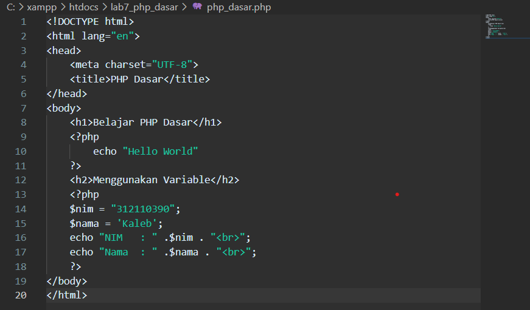

- Tampilan Output
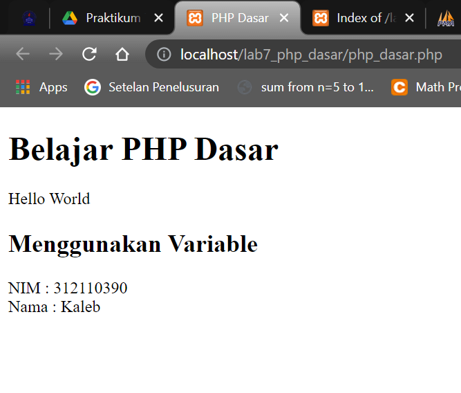

### Predefine Variable $_GET
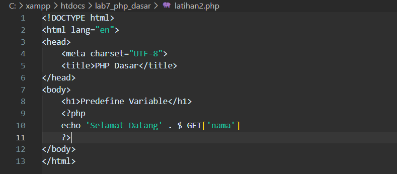

- Tampilan Output
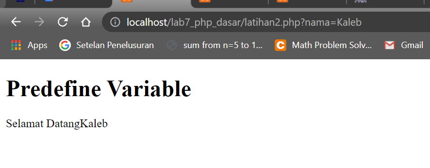

### Membuat Form Input
- Operator
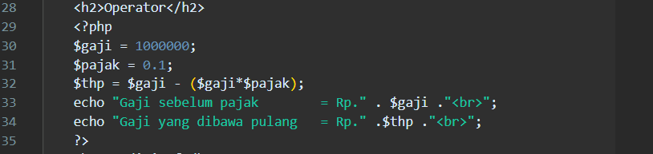

- Tampilan Output
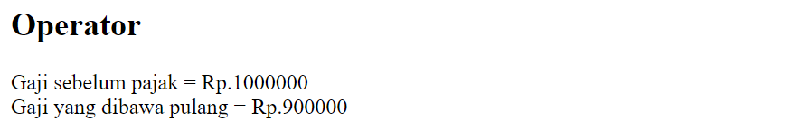

- Perulangan For

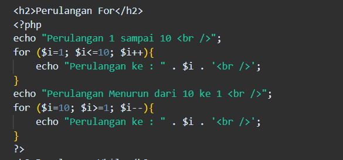

- Tampilan Output

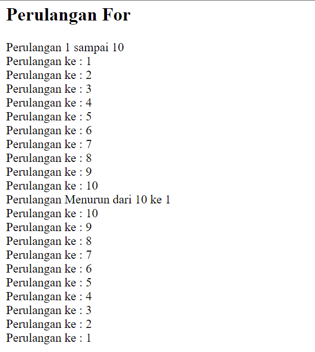

- Perulangan While

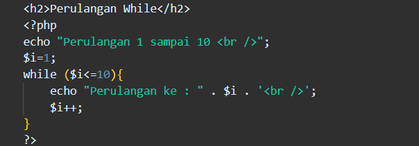

- Tampilan Output

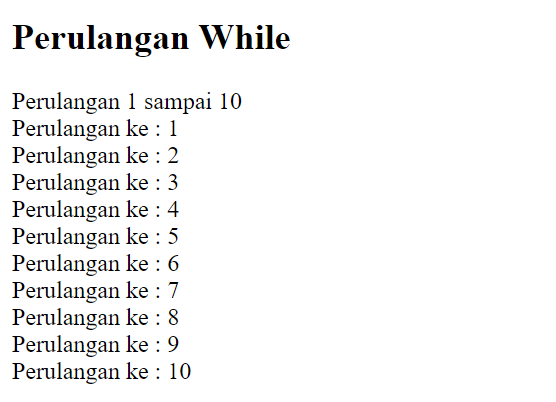

- Perulangan Dowhile

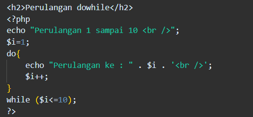

- Tampilan Output

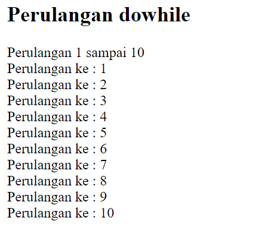
